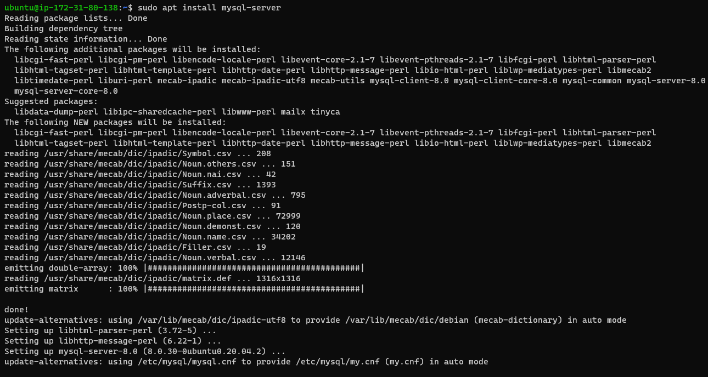

## project 1 documentation

`sudo apt update`

`sudo apt install apache2`

`sudo systemctl status apache2`

`sudo apt install mysql-server`

`sudo mysql`

`sudo apt install php libapache2-mod-php php-mysql`
